# Smash Dates

**Automatic fixture scheduling for badminton leagues.**

Smash Dates is a web application for running multi-club badminton leagues end to end: set up clubs, teams, venues and divisions; configure seasons and playing weeks; then let the built-in scheduler generate a complete home-and-away fixture list that respects every real-world constraint — venue availability, blocked dates, derby-first rules and gender/week-type matching. Clubs confirm or reject their fixtures, results roll up into live standings, and a calendar-driven background service moves seasons through their lifecycle automatically.

The whole thing ships as a single container: a .NET 10 API that also serves the Angular client, backed by PostgreSQL.

---

## Features

**Access & roles**
- Email/password accounts with cookie authentication; the first registered user becomes the **SystemAdmin**.
- **Email verification** gates login — new sign-ups confirm their address via a one-time link before they can sign in (the bootstrap SystemAdmin is auto-verified). Self-service **password reset** and **resend verification** round out the flow; tokens are single-use, hashed at rest and expire — re-issuing a link invalidates the previous one, and spent tokens are pruned by a background job. Links ride the notification outbox (logging sender by default).
- Three role scopes: **SystemAdmin** (bootstrap), **LeagueAdmin@League** and **ClubAdmin@Club** — granted per league/club, with last-admin protection.

**League setup**
- **Leagues** and **Divisions** (gender, rank, rubbers-per-match, configurable points scheme).
- **Clubs** (open registry with short codes), **Teams** (fixed gender) and **Venues** (court capacity).
- **Club ↔ League memberships** with a full lifecycle: invite → accept / decline → withdraw / expel, with mid-season locks.
- **Bulk CSV import** for clubs, teams, venues and season entries — partial import with a per-row report, upsert on match, and a downloadable template per importer.

**Seasons**
- **Seasons** with an explicit ordered list of **Weeks** (Level vs Mixed), validated for non-overlap and in-range.
- **Season entries** assign teams to divisions per season (promotion/relegation without losing identity), gated by gender match and accepted membership.
- Lifecycle `Draft → Scheduling → Proposed → Active → Closed`. **Generation runs as a background job** (the season sits in `Scheduling` while a worker builds the fixtures, then moves to `Proposed`, or back to `Draft` with a reason if it can't); season transitions are otherwise **automatic and date-driven** (with manual admin overrides).
- **Blocked dates** at Venue, Club or Team scope, locked once a season is Active.

**The scheduler**
- Custom heuristic engine (no external solver): **Berger double round-robin → derby-first ordering → greedy placement** honouring all hard constraints (one match per team per date, venue capacity, blocked dates, week-type ↔ division gender, home venue from the home club's pool).
- **2-opt soft-constraint optimisation** to spread out each team's matches and balance the gap between home and away legs — with **per-league tunable** weights.
- **Incremental re-run** that locks Confirmed fixtures and reshuffles only the rest.

**Match lifecycle**
- `Proposed → Confirmed` once both clubs accept (LeagueAdmin can force-confirm), or `→ Rejected`.
- **Postpone** a Confirmed match back into the pool for re-scheduling.
- Record **results** and **walkovers**; **standings** are derived live per division (played/won/drawn/lost, rubbers for/against/diff, points) with a head-to-head tiebreak.
- Club admins get a "my club's matches" view to act on their own fixtures.
- **Calendar feed (iCal)** — subscribe a calendar app to a club's, league's or team's fixtures via a tokenised, login-free `.ics` URL.

**Notifications**
- Domain events (invites, membership responses, match confirmations/rejections/postponements) plus auth emails (verification, password reset) are written to an **outbox** and delivered by a background sender. **Set `Smtp:Host`** to deliver over **SMTP** (MailKit); with no host configured it falls back to a logging sender, so dev and tests need no mail server.

**Players & registrations**
- **Players** are global, club-managed roster records (no login); clubs link them as **Member** or **Visitor**.
- **Discipline registrations** (`Level` / `Mixed`) are scoped to `(player, club, league)`: a club registers a Member, the **league confirms**, and at most one club holds a player's discipline per league.
- **Transfers** move a confirmed registration between clubs — the receiving club requests, the releasing club and the league both approve. See [ADR 0003](docs/adr/0003-player-discipline-registration.md).
- **Team squads** — assign players to a team, with eligibility enforced: the player must be confirmed for the team's discipline at the club, with a matching gender (squads can be built before the team is entered in a season).

**Club night (pegboard)**
- A live **pegboard session** replaces the physical club-night board: track who turned up (roster players or ad-hoc guests), a fair waiting queue (with each player's wait time), courts you add/remove on the fly, and the games on them — singles, level doubles, mixed, or a "funny" (e.g. 3+1) — with a required winner, optional score, and per-night played/won stats.
- Fill a free court three ways — **manual**, **suggest**, or **auto-fill** — balancing longest-waiting, valid gender makeup, partner/opponent variety, and player **grade**. A makeup that breaks the game type's rule warns but never blocks the host.
- Run by a new per-club **Session Host** role (or any club admin / SystemAdmin); any signed-in user can watch. The board streams live to every viewer over **Server-Sent Events** — see [ADR 0004](docs/adr/0004-sse-for-pegboard-live-updates.md). Viewers get the same board **read-only** (host controls hidden), and a **closed** session stays viewable as a read-only history with each attendee's final stats.

**Interface**
- **Light / dark theme** — follows the OS preference by default, with a toggle that persists an explicit choice (no flash on load).

---

## Tech stack

| Layer | Choice |
|-------|--------|
| Backend | **.NET 10**, ASP.NET Core **Minimal APIs** (one endpoint per file) |
| Data | **PostgreSQL** via **Dapper + Npgsql** (repository pattern, no EF Core) |
| Migrations | **DbUp** — embedded SQL scripts applied idempotently on startup |
| Auth | Cookie authentication + antiforgery; **BCrypt** password hashing; Data Protection keys persisted in Postgres |
| Background work | `BackgroundService` hosted services (season transitions, schedule generation, notification delivery, auth-token cleanup) |
| Real-time | **Server-Sent Events** for the live club-night pegboard (in-process pub/sub) |
| Frontend | **Angular 21** (standalone components, signals, reactive forms) + **Tailwind CSS**, served same-origin as static files |
| Tests | **xUnit v3** + **Testcontainers** (integration, real Postgres) for the backend; **Vitest** for the frontend |
| Packaging | Single multi-stage **Docker** image (Angular production bundle + .NET publish) |

Architecture decisions are recorded in [docs/adr/](docs/adr/) and the domain language in [CONTEXT.md](CONTEXT.md).

---

## Quick start

### Run with Docker (recommended)

Start PostgreSQL:

```bash
docker compose up -d
```

Build and run the app image (serves API + client on **:8080**, applies all migrations on startup):

```bash
docker build -t smash-dates .
docker run -p 8080:8080 \
  -e "ConnectionStrings__Postgres=Host=host.docker.internal;Port=5432;Database=smash_dates;Username=postgres;Password=postgres" \
  smash-dates
```

Open <http://localhost:8080> and register — the first account becomes the SystemAdmin.

> **HTTPS in production:** auth/antiforgery cookies are `Secure`, so a production deployment must be reached over HTTPS. The container is built to sit behind a TLS-terminating reverse proxy / ingress and honours `X-Forwarded-Proto` / `X-Forwarded-For` (`UseForwardedHeaders`). Over plain HTTP, cookie-issuing endpoints (register/login) return 500 by design.

> **Email delivery:** verification and password-reset links (and all other notifications) only reach users once SMTP is configured. Set the `Smtp__*` env vars — at minimum `Smtp__Host` — e.g. `-e "Smtp__Host=smtp.example.com" -e "Smtp__Port=587" -e "Smtp__Username=…" -e "Smtp__Password=…" -e "Smtp__FromAddress=no-reply@yourdomain"`. With no host set, mail is written to the application log instead.

### Run locally (dev loop)

Prerequisites: **.NET 10 SDK**, **Node.js + npm**, **Docker** (for Postgres / integration tests).

```bash
docker compose up -d                 # Postgres on localhost:5432
cd ClientApp && npm install && cd ..  # first run only
```

Two terminals, same origin (no `ng serve`, no proxy):

```bash
# Terminal 1 — rebuild the Angular bundle on change
cd ClientApp && npm run watch

# Terminal 2 — run the API (also serves the client + SPA fallback)
dotnet run
```

The connection string is read from `ConnectionStrings:Postgres` (default `localhost:5432`, `postgres`/`postgres`); override with the `ConnectionStrings__Postgres` env var.

### Tests

```bash
dotnet test            # backend (integration tests need Docker for Testcontainers)
cd ClientApp && npm test   # frontend
```

### Adding a migration

Create `Migrations/Scripts/NNNN_description.sql` (zero-padded sequence). It's picked up as an embedded resource and applied in name order on next startup.

### Versioning & releases

Releases are **CalVer**: `vYYYY.M.MICRO` (e.g. `v2026.5.0`), where `MICRO` is a per-month counter that resets at the start of each month.

Every merge to `main` runs the `Release` workflow, which:

1. computes the next version from existing tags,
2. builds and pushes the container image to GHCR — tagged `:YYYY.M.MICRO`, `:YYYY.M`, and `:latest`, with build provenance + SBOM attestation,
3. creates the git tag and a GitHub Release with auto-generated notes.

Put `[skip release]` in the merge commit message to skip a release.

```bash
docker pull ghcr.io/aamcatamney/smash-dates:latest
```

A running container exposes `GET /health` (liveness) and `GET /api/version` (the CalVer version stamped in at build).

---

## Screenshots

> Images live in [`docs/screenshots/`](docs/screenshots/). The league and club pages organise their sections into tabs (the active tab is kept in the URL).

### Leagues & divisions
The admin entry point: the league page, tabbed into Divisions · Seasons · Clubs · Players · Scheduler.

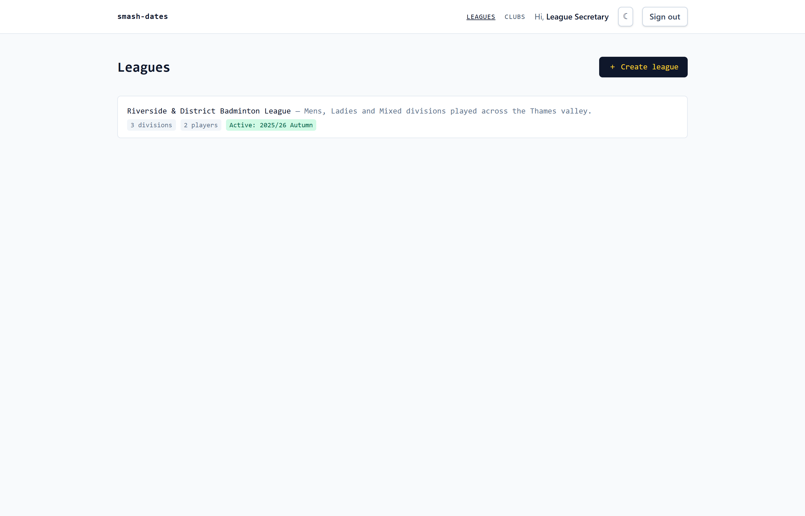
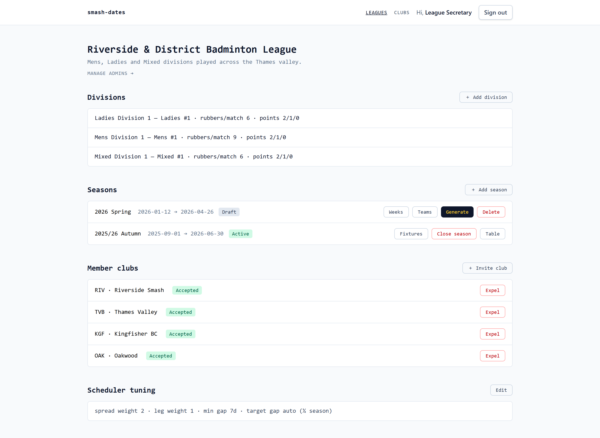

### Season setup & scheduling
Configure a season's weeks, assign teams to divisions, then generate the fixture list.

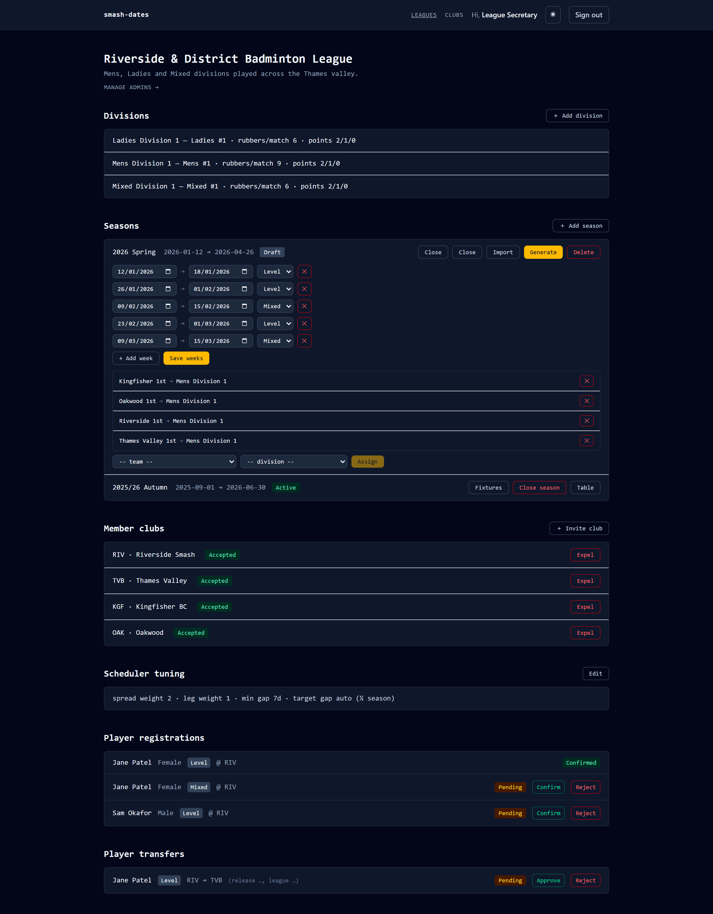
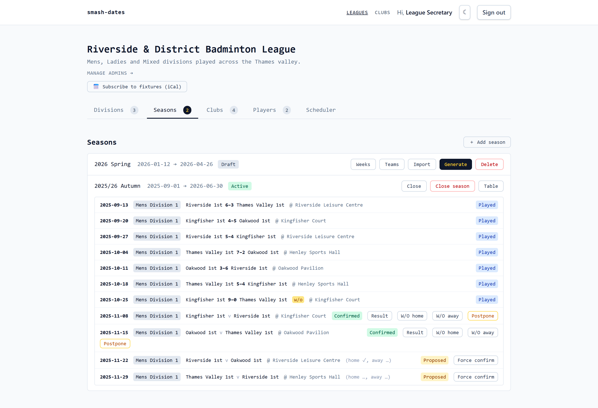

### Match lifecycle & standings
Confirm, reject or record results on fixtures; standings update live with colour-coded statuses.

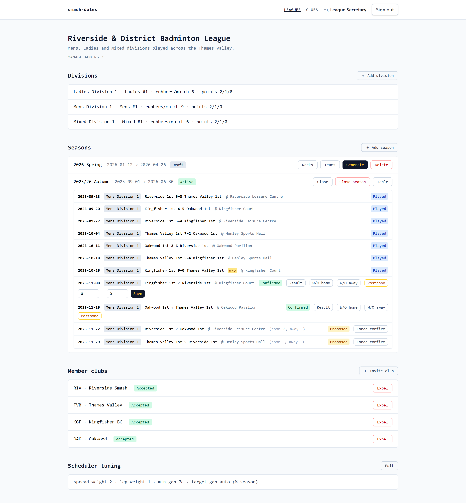
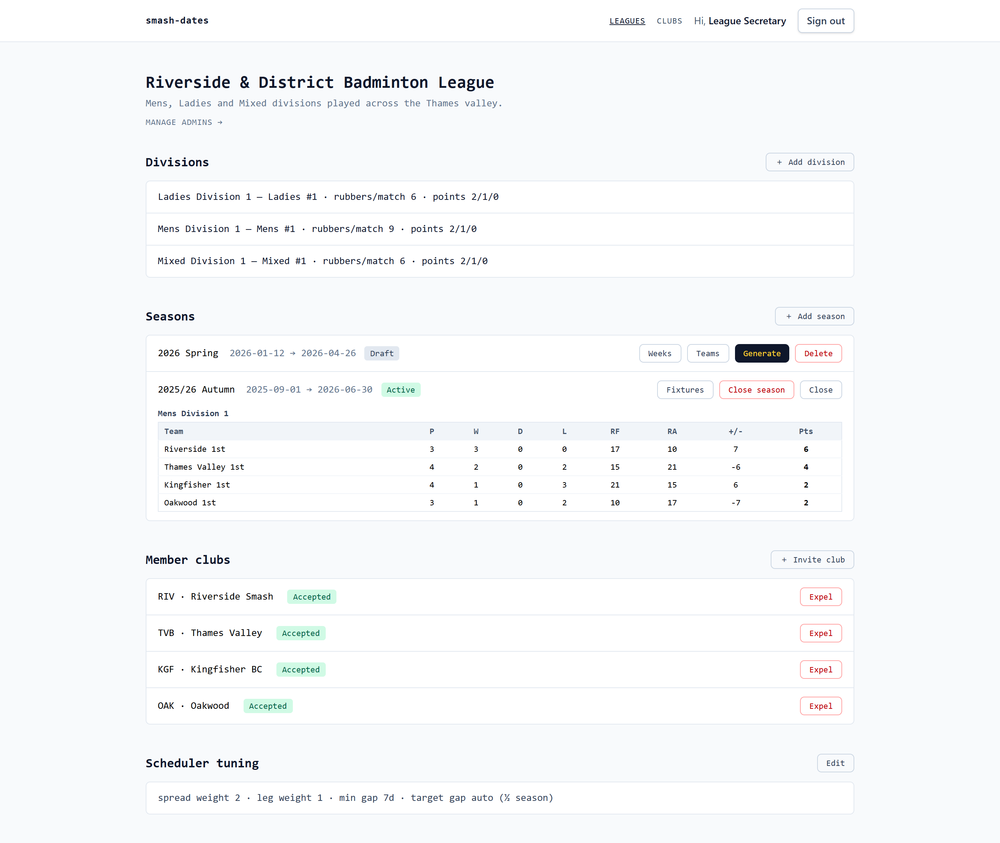

### Clubs
The club page, tabbed into Teams · Venues · Players · Matches · Blocked dates · Admins (Teams shows squads).

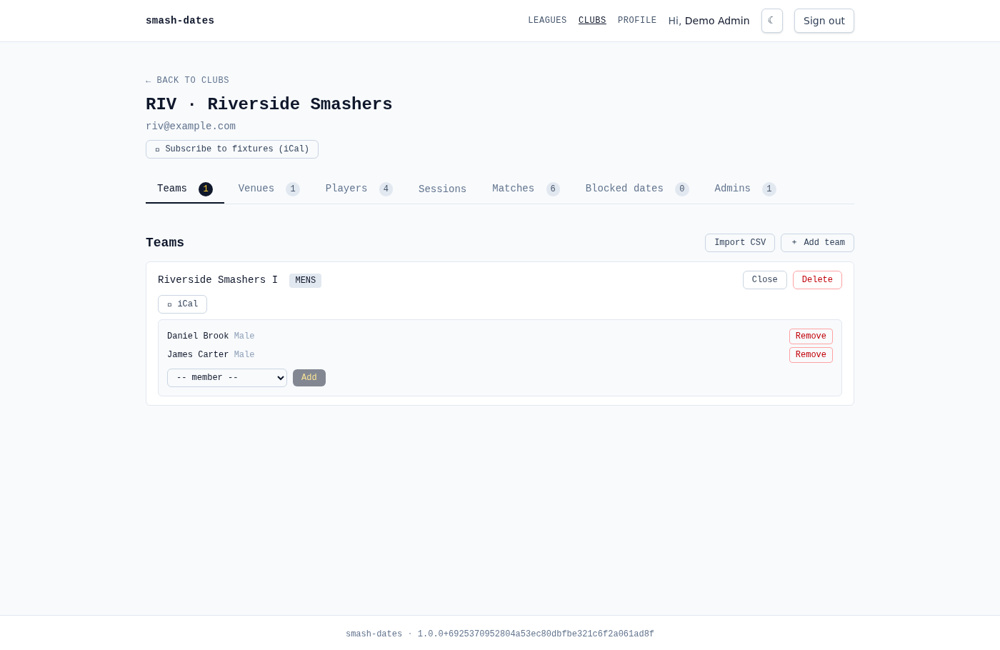

### Club night (pegboard)
The **Sessions** tab opens a club night; the full-screen board tracks courts, live games (with sides + type), and a fair waiting queue — streamed live to every viewer over SSE.

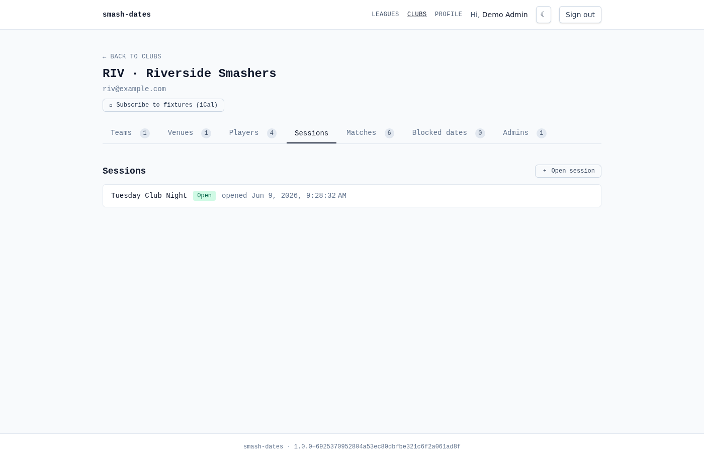
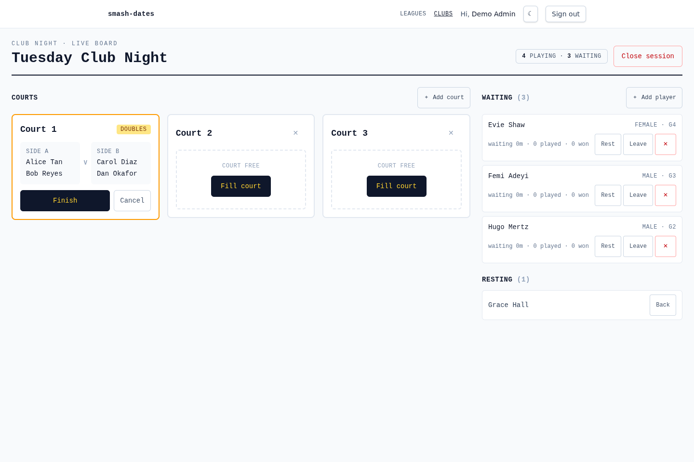

### Bulk CSV import
Import clubs, teams, venues or season entries from a CSV — partial import with a per-row result and a downloadable template.

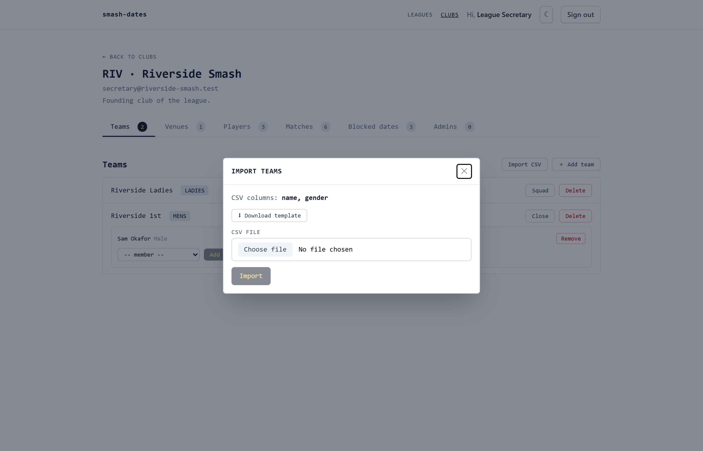

### Players & registrations
The league confirms discipline registrations and adjudicates transfers between clubs.

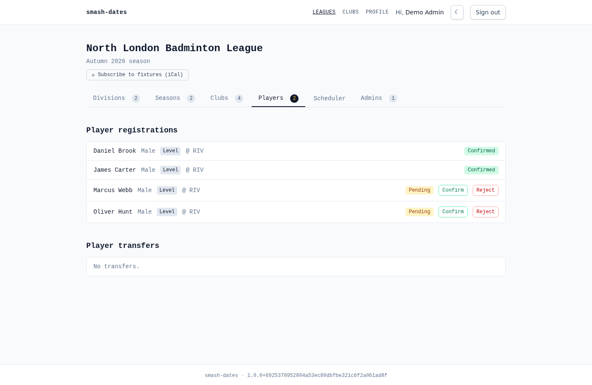

### Light & dark themes
Every screen supports light and dark, following the OS preference with a persisted toggle.

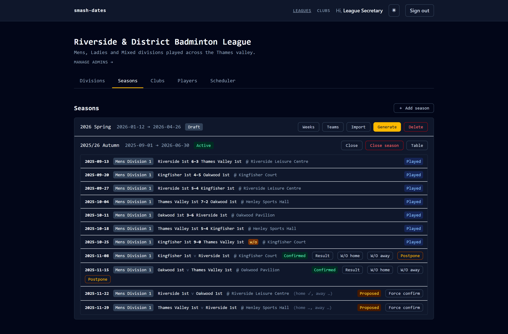

---

## License

MIT — see [LICENSE](LICENSE).
